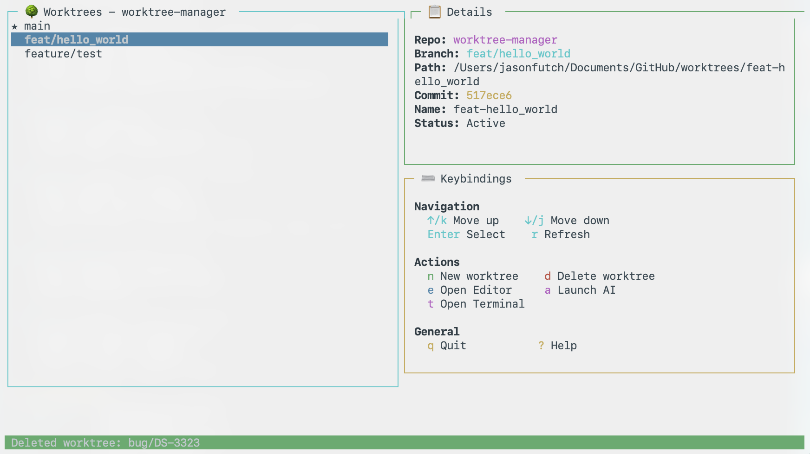
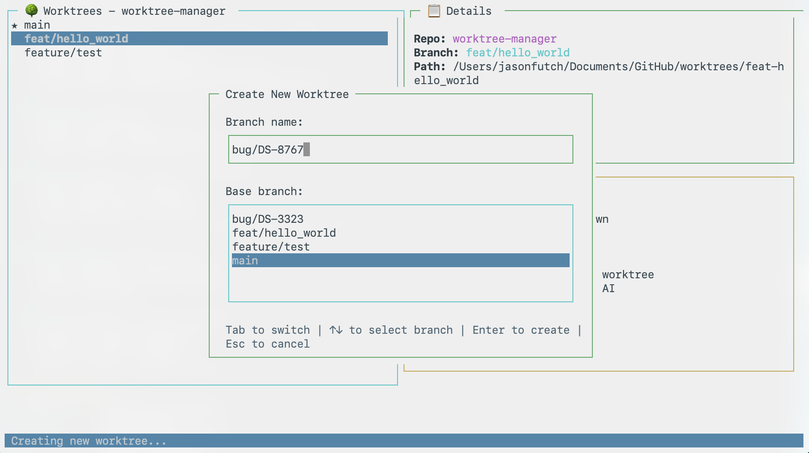
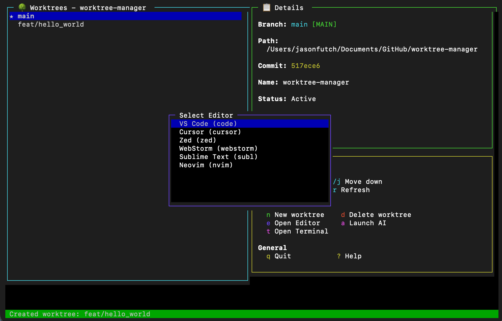
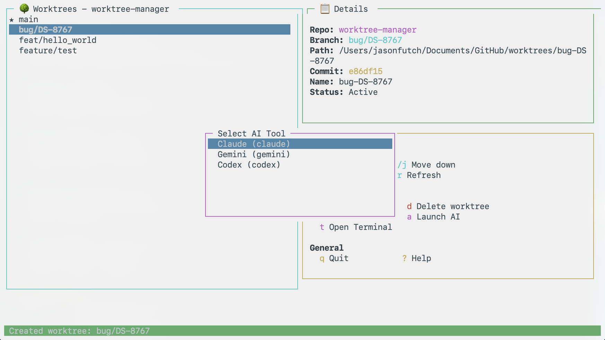

# Worktree Manager TUI/CLI

A terminal app for managing git worktrees with AI assistance.

## Features

- **TUI Interface** - Full terminal UI built with blessed
- **Git Worktree Management** - Create, list, and remove worktrees
- **IDE Integration** - Open worktrees in VS Code, Cursor, Zed, and more
- **AI Integration** - Launch Claude, Gemini, or Codex in any worktree
- **Parallel Development** - Work on multiple features simultaneously
- **Auto-Update Notifications** - Get notified when a new version is available

## Requirements

- Node.js >= 18
- Git
- Optional: VS Code, Cursor, Zed, Claude CLI

## Installation

```bash
npm install -g @jasonfutch/worktree-manager
```

## Usage

### Interactive TUI Mode

```bash
# Launch TUI in current directory
wtm

# Launch TUI for a specific repo
wtm /path/to/repo
```

### Keybindings

| Key     | Action                    |
| ------- | ------------------------- |
| `↑/k`   | Move up                   |
| `↓/j`   | Move down                 |
| `Enter` | Select/Details            |
| `n`     | Create new worktree       |
| `d`     | Delete worktree           |
| `e`     | Open in editor (selector) |
| `t`     | Open terminal             |
| `a`     | Launch AI tool (selector) |
| `r`     | Refresh                   |
| `?`     | Help                      |
| `q`     | Quit                      |

### CLI Commands

```bash
# List all worktrees
wtm list
wtm list /path/to/repo

# Create a new worktree
wtm create feature/my-feature
wtm create feature/my-feature -b main
wtm create feature/my-feature -p /custom/path

# Remove a worktree
wtm remove feature/my-feature
wtm remove feature/my-feature --force

# Open worktree in editor
wtm open feature/my-feature
wtm open main -e cursor
# Editors: code, cursor, zed, webstorm, subl, nvim

# Open terminal in worktree
wtm terminal feature/my-feature
wtm term main

# Launch AI tool in worktree
wtm ai feature/my-feature
wtm ai main -t gemini
# Tools: claude, gemini, codex

# Update to latest version
wtm update

# Show detailed help
wtm help
```

## How It Works

1. **Worktrees** - Uses `git worktree` to create isolated working directories for each branch
2. **Parallel Development** - Each worktree is independent, allowing you to run different AI coding sessions
3. **IDE Integration** - Opens editors in the worktree directory so your AI assistant has the right context
4. **Terminal Sessions** - Opens new terminal windows/tabs in the worktree directory

## Updating

The CLI automatically checks for updates once per day and notifies you when a new version is available:

```
╭─────────────────────────────────────────────────╮
│                                                 │
│   Update available 1.0.0 → 1.1.0                │
│   Run npm i -g @jasonfutch/worktree-manager     │
│                                                 │
╰─────────────────────────────────────────────────╯
```

You can also manually update at any time:

```bash
wtm update
```

## Screenshots

### Main Interface



### Create New Worktree



### Open In Editor



### Open In AI Tool



---

## Development

### Installation from Source

```bash
git clone https://github.com/jasonfutch/worktree-manager
cd worktree-manager
npm install
npm run build

# Link globally for testing
npm link
```

### Commands

```bash
npm run dev      # Run in development mode
npm run build    # Build TypeScript
npm run clean    # Clean build artifacts
```

## Architecture

```
worktree-manager/
├── src/
│   ├── index.ts          # CLI entry point
│   ├── types.ts          # TypeScript types
│   ├── errors.ts         # Custom error classes
│   ├── constants.ts      # Application constants
│   ├── version.ts        # Version from package.json
│   ├── git/
│   │   └── worktree.ts   # Git worktree operations
│   ├── tui/
│   │   └── app.ts        # Blessed TUI application
│   └── utils/
│       ├── helpers.ts    # Utility functions
│       ├── shell.ts      # Shell escaping utilities
│       ├── launch.ts     # Editor/terminal launchers
│       └── checks.ts     # Startup validation
├── dist/                 # Compiled output
├── package.json
├── tsconfig.json
└── README.md
```

## License

MIT
